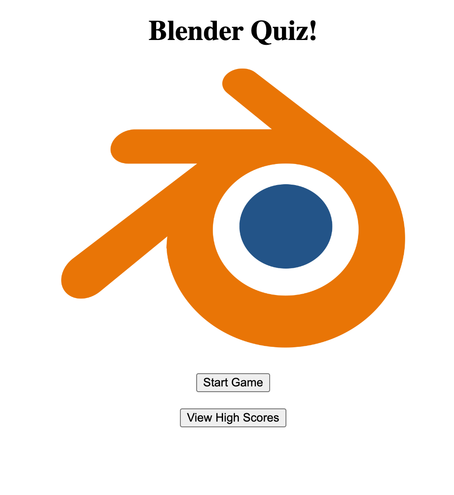

# JS Quiz

A short javascript game for remembering Blender hotkeys and stuff.

I have not finished this assignment and am finding myself umable to finish at this time. I have figured out how to start a timer function when the first question displays, but I am having trouble figuring out how to append question object choices as list elements (they do show up on the page, however) and capturing click events on the choices to verify whether they are right or wrong answers.

answerQuestion(), endQuiz(), and hiScore() are all functions I have not had a chance to finish and have only pseudo-coded. Being unable to solve the issues listed above, I find that there isn't much work I am able to get done on these three functions.

Overall, this assignment has proven to be incredibly difficult (especially for myself, a guy with no background in coding), but I do believe I will be able to figure this out at another time.

Link to currently deployed application can be found [here](https://cplancich.github.io/JS_Quiz/).

